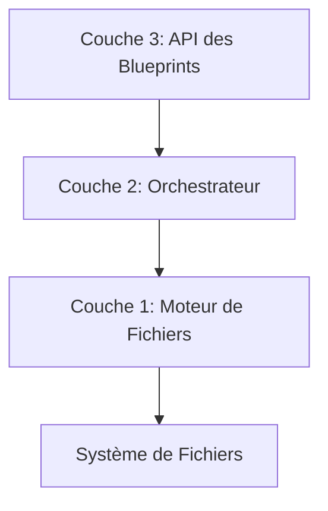

## **1. Philosophie & Objectifs**

<aside>
💡

**Notre Mission:** Fournir aux développeurs un outil qui élimine la friction de la configuration de projet pour qu'ils puissent se concentrer sur l'essentiel : la création de valeur. The Architech n'est pas un simple générateur de "boilerplate", c'est un **architecte de fondations logicielles** robustes, maintenables et prêtes pour la production.

</aside>

### Nos choix architecturaux sont guidés par 3 principes :

1. **Simplicité pour le Créateur :** La complexité doit être dans la CLI, jamais dans le Blueprint.
2. **Sécurité par Défaut :** Ne jamais corrompre le projet d'un utilisateur. Chaque opération doit être sûre et prévisible.
3. **Extensibilité Ouverte :** L'architecture doit encourager et faciliter la contribution de la communauté.

## **2. Le "Génome de Projet" : Le Cœur Déclaratif**

Toute génération commence par un fichier de configuration, le **"Génome"** (genome.yaml). C'est un fichier déclaratif qui décrit l'**état désiré** du projet, et non les étapes pour y parvenir.

- Cliquez pour voir un exemple de  genome.yaml

```yaml
# genome.yaml
project:
name: my-awesome-app
root: '.'

# Les briques technologiques de base
adapters:
- id: framework/nextjs
version: '1.0.0'
- id: database/drizzle
version: '1.0.0'
- id: auth/better-auth
version: '1.0.0'

# Les ponts qui connectent les briques
integrators:
- id: connect/better-auth-nextjs
version: '1.0.0'

# Options spécifiques à cette intégration
features:
enableTwoFactorAuth: true
enableMagicLink: false
```

## **3. L'Architecture en 3 Couches : De l'Intention à l'Exécution**

Pour transformer un Génome en un projet fonctionnel, la CLI utilise une architecture stricte à 3 couches.



### **Couche 3 : L'API des** Blueprints **(Le "Langage")**

C'est l'interface publique pour les contributeurs. Elle est conçue pour être de haut niveau et sémantique.

Un ⁠Blueprint est une simple liste d'actions. Voici l'ensemble des actions disponibles en V1 :

| Action | Description |
| --- | --- |
| ⁠CREATE_FILE | Crée un nouveau fichier. Échoue s'il existe. |
| ⁠INSTALL_PACKAGES | Ajoute des dépendances (dev ou non) à ⁠package.json. |
| ⁠ADD_SCRIPT | Ajoute un script à ⁠package.json. |
| ⁠ADD_ENV_VAR | Ajoute des variables à ⁠.env et ⁠.env.example (avec déduplication). |
| ⁠ADD_TS_IMPORT | Ajoute un import à un fichier ⁠.ts/⁠.tsx. |
| ⁠MERGE_JSON | Fusionne un objet JSON dans un fichier ⁠.json existant. |
| ⁠ENHANCE_FILE | L'action avancée. Applique une modification complexe et prédéfinie. |
| ⁠RUN_COMMAND | Exécute une commande shell. |

### **Couche 2 : L'Orchestrateur (Le "Cerveau")**

C'est le traducteur intelligent. Il prend les actions sémantiques et les convertit en opérations de bas niveau.

- **Détail du fonctionnement de l'Orchestrateur**
    1. **Analyse Préliminaire :** L'Orchestrateur reçoit un Blueprint. Il le passe d'abord à un BlueprintAnalyzer.
    2. **Décision Stratégique :** L'Analyzer détermine si le blueprint est "Simple" (ne contenant que des actions non-modificatives) ou "Complexe" (contenant au moins une action comme ENHANCE_FILE ou MERGE_JSON).
    3. **Choix du Mode d'Exécution :**
        - **Mode Rapide (Simple) :** Les actions sont exécutées séquentiellement et écrivent directement sur le disque. C'est optimisé pour les Adapters.
        - **Mode Sécurisé (Complexe) :** Un **VFS (Virtual File System) "par blueprint"** est instancié. C'est optimisé pour les Integrators.
    4. **Traduction des Actions :** L'Orchestrateur convertit chaque action sémantique en un ou plusieurs appels aux primitives de la Couche 1.
        - INSTALL_PACKAGES devient un appel à engine.mergeJsonFile('package.json', ...).
        - ENHANCE_FILE devient un appel à engine.modifyTsFile(...) en utilisant un "Modifier" enregistré.

### **Couche 1 : Le Moteur de Fichiers (Les "Mains")**

Cette couche assure la sécurité et la fiabilité.

- **Le VFS "à la Demande" :** C'est un bac à sable transactionnel.
    
    Il est **créé vide** au début d'un blueprint complexe.
    
    Il utilise le **Lazy Loading** : un fichier n'est lu depuis le disque que la première fois qu'il est nécessaire.
    
    Toutes les modifications sont faites en mémoire.
    
    Le flushToDisk() à la fin garantit une **écriture atomique**.
    

- **La Primitive** modifyTsFile **:** C'est le cœur de l'intelligence pour les modifications complexes. Elle utilise ts-morph pour parser le code en AST et appliquer des transformations chirurgicales, garantissant que le formatage et les commentaires de l'utilisateur sont préservés.

## **4. L'Écosystème Modulaire :** Adapters **vs.** Integrators

La compréhension de cette distinction est **fondamentale** pour contribuer au projet.

> 💬 "Les Adapters construisent les piliers. Les Integrators construisent les ponts."
> 

|  | ⁠Adapters | ⁠Integrators |
| --- | --- | --- |
| **Objectif** | Installer une technologie **isolée**. | **Connecter** 2 ou plusieurs technologies. |
| **Exemple** | ⁠adapter-drizzle | ⁠integrator-drizzle-nextjs |
| **Actions Typiques** | ⁠CREATE_FILE, ⁠INSTALL_PACKAGES | ⁠ENHANCE_FILE, ⁠ADD_TS_IMPORT |
| **Complexité** | Faible à Moyenne | Élevée |
| **Dépendances** | Idéalement aucune sur d'autres adapters. | Toujours dépendant d'au moins 2 adapters. |

Ce modèle de "séparation des responsabilités" garantit que la logique est bien organisée, que les Adapters sont réutilisables et que la complexité est contenue uniquement là où elle est nécessaire : dans les Integrators.

## **5. Le Futur : La Vision de l'IA et de la Personnalisation**

Cette architecture a été conçue pour l'avenir.

•	**Le** BlueprintAnalyzer est la première brique d'une IA d'assistance. Demain, il pourra valider la sémantique d'un blueprint, suggérer des optimisations ou détecter des conflits potentiels.

•	**L'action** ENHANCE_FILE **avec son** ModifierRegistry crée une bibliothèque d'opérations de refactoring complexes. Une future IA pourra composer ces "modifiers" pour exécuter des changements de grande envergure demandés en langage naturel par l'utilisateur.

•	**Le** Génome est la représentation parfaite de l'état d'un projet. Une IA pourra lire le Génome d'un projet existant pour comprendre sa stack et proposer des migrations ou des mises à jour intelligentes.

Ce document fournit les fondations conceptuelles. Pour les détails d'implémentation de chaque action ou service, veuillez vous référer à la documentation de code JSDoc correspondante.

---

Prompt:

ok parfait. pendant qu'il travaille je suis en train d'update un document d'architecture technique. on a eu beaucoup de changements de puis et j'aimerais donc que tu m'aide a lister tous nos changement, notre nouvelle structure COMPLETE (vraiment complet !) et a rgarder comment on sturcture généralement ce genre de document pour un projet "complexe" et open source.
le document seras utilisé en interne mais seras la base de la creation d'autres documents pour la com externe (comme le whitepaper)
pret ? @web besoin d'autres précisions ?

ok super interressant, mais je pensais faire un document specifique a la CLI the architech, pas un document sur la vision long terme. mais merci pour ceci, je le garde !

maintenant place a ce sujet plus concret => comment marche la CLI ! (et expliquer vraiment tous nos doutes, nos choix, pourquoi, comment, etc...), et faire un chapitre complet sur la modularité via les blueprints, puis sur les adapters et integrators et pourquoi cette différences, puis sur les "features", et evidemment pas mal de data sur comment la CLI:

•	récupère, lit, comprend, lance et fait fonctionner chaque blueprints.

•	fait marcher le systme de génération globale

- ne pas oublier de parler du génome aussi
- etc...
- n'oublie rien !

PS: ce document seras sur un notion, alors n'hesite pas a proposer du layout propre a cet outil